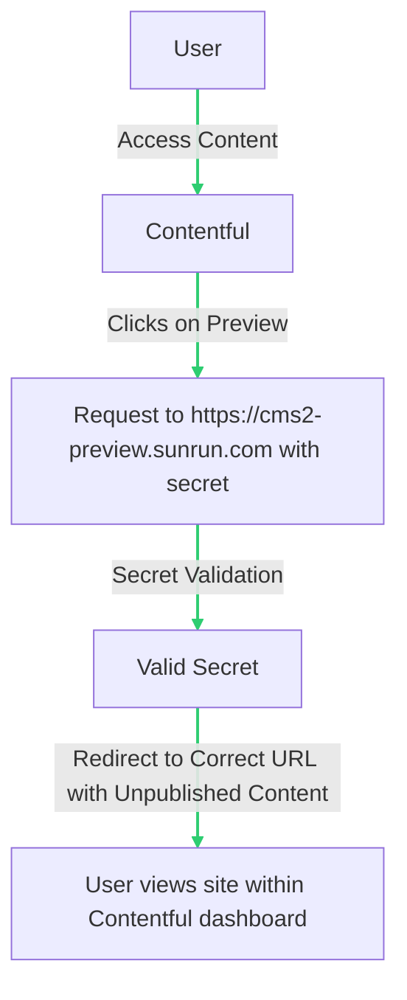
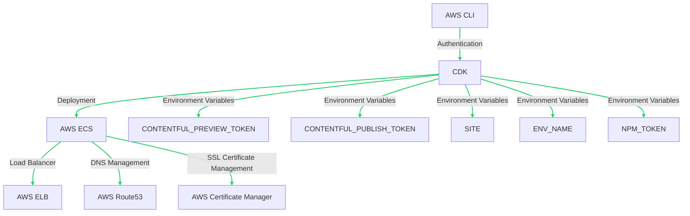

# Infra-ECS

Infra-ECS is a project that uses AWS CDK (Cloud Development Kit) to deploy the multisite app in Server-Side Rendering (SSR) mode on AWS ECS (Elastic Container Service). This setup allows us to have a preview mode available for the marketing team. The infrastructure includes a load balancer, DNS management through AWS Route53, and SSL certificate management through AWS Certificate Manager.

## Flow Diagram
Here is the diagram  that represents the flow  that is going to be followed by the user:



This diagram shows the user flow:

1. The user accesses the content they wish to edit in Contentful.
2. The user clicks on 'Preview' in Contentful.
3. Contentful sends a request to the domain https://cms2-preview.sunrun.com, including a secret for authentication.
4. The secret is validated to ensure that only authorized users can view unpublished content.
5. The user is redirected to the correct URL, but with the unpublished content.
6. The user views the site within the Contentful dashboard.
## Environment Setup

To use CDK in any environment, you need to be authenticated with AWS CLI and have the following environment variables:

- CONTENTFUL_PREVIEW_TOKEN
- CONTENTFUL_PUBLISH_TOKEN
- SITE
- ENV_NAME
- NPM_TOKEN

## Infrastructure Diagram

Here is a diagram that represents the CDK implementation:



This diagram shows how AWS CLI authenticates with CDK, which then deploys the application on AWS ECS. AWS ECS uses a load balancer (AWS ELB), manages DNS with AWS Route53, and handles SSL certificates with AWS Certificate Manager. In addition, CDK uses several environment variables, including *CONTENTFUL_PREVIEW_TOKEN*, *CONTENTFUL_PUBLISH_TOKEN*, *SITE*, *ENV_NAME*, and *NPM_TOKEN*.

[If you wish to edit this diagram or make any changes, you can do so here.](https://showme.redstarplugin.com/s/e2P4soSO)

If you're interested in contributing to open-source projects, you might consider [contributing to this project](https://github.com/bra1nDump/show-me-chatgpt-plugin/issues).

## Package.json

The `package.json` file for this project is as follows:

```json
{
  "name": "infra-ecs",
  "version": "0.1.0",
  "bin": {
    "infra-ecs": "bin/infra-ecs.js"
  },
  "scripts": {
    "build": "tsc",
    "watch": "tsc -w",
    "test": "jest",
    "cdk": "cdk"
  },
  "devDependencies": {
    "@types/jest": "^29.5.1",
    "@types/node": "20.1.7",
    "jest": "^29.5.0",
    "ts-jest": "^29.1.0",
    "aws-cdk": "2.81.0",
    "ts-node": "^10.9.1",
    "typescript": "~5.0.4"
  },
  "dependencies": {
    "aws-cdk-lib": "2.81.0",
    "constructs": "^10.0.0",
    "source-map-support": "^0.5.21"
  }
}
```
## Running the Project

To use CDK, use:

```bash
npm run cdk
```

## URL of each environment
The production url:
- *Dev:* https://devmaj-preview.sunrundev.com
- *Prod:* https://cms2-preview.sunrun.com